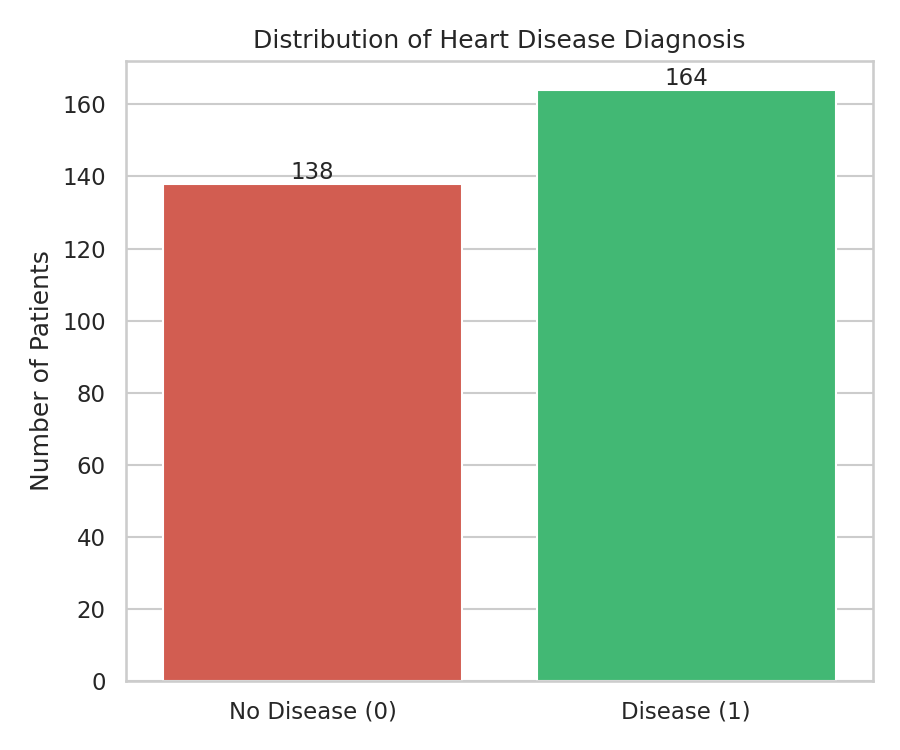
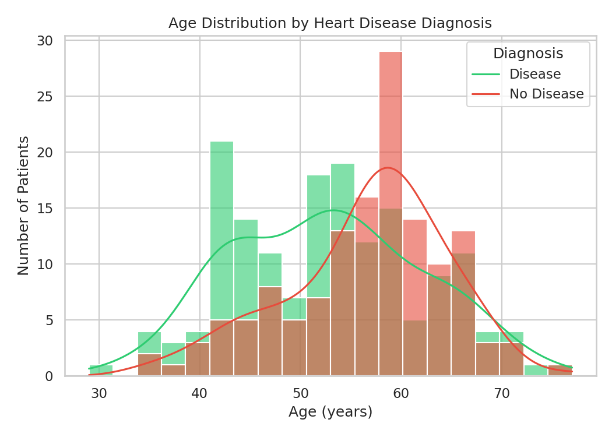
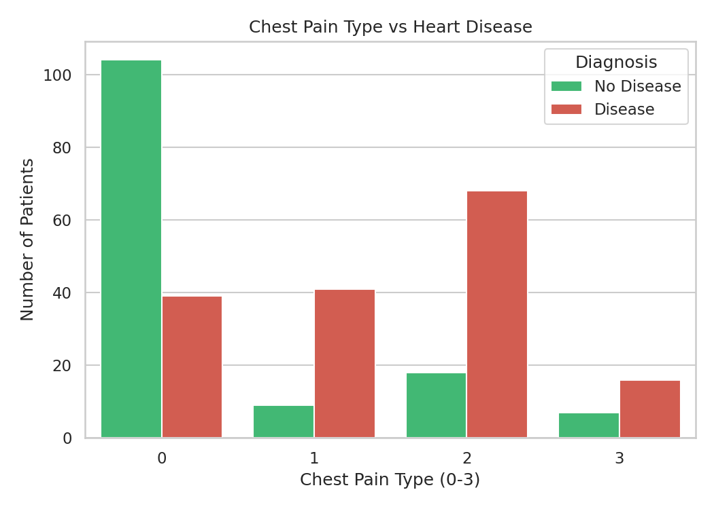
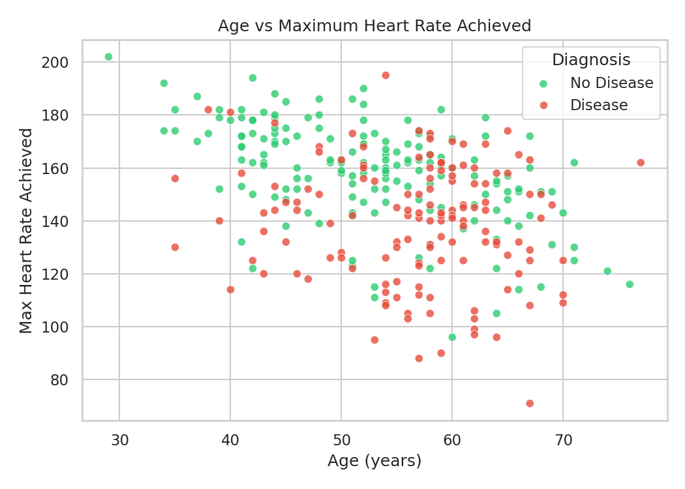
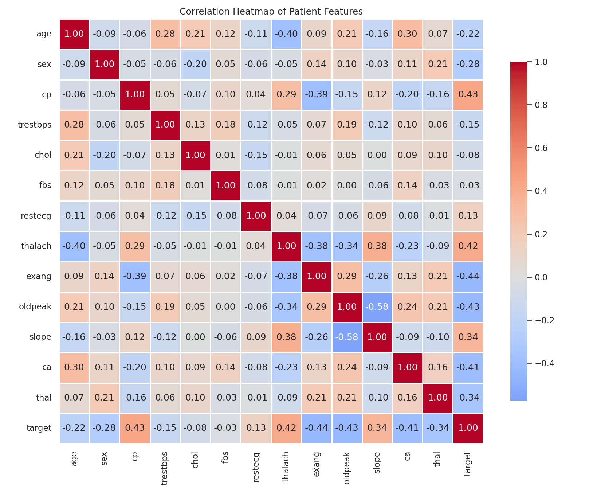
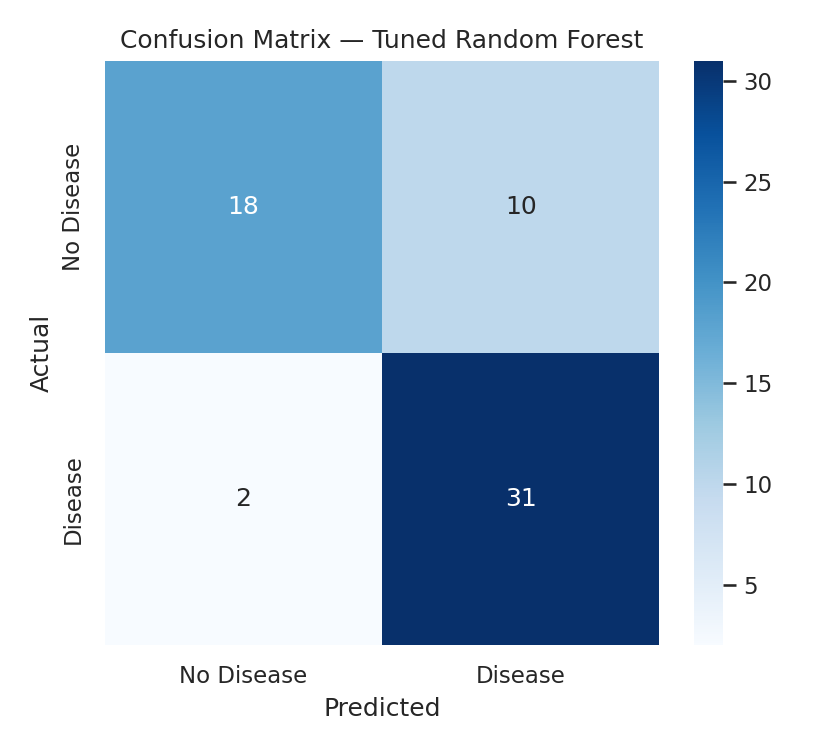
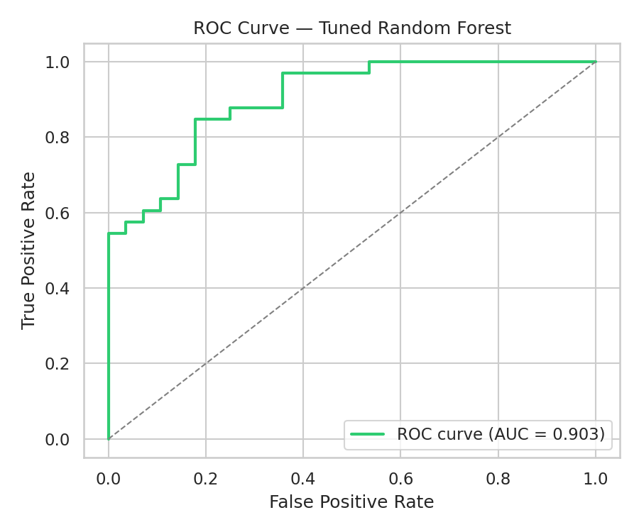
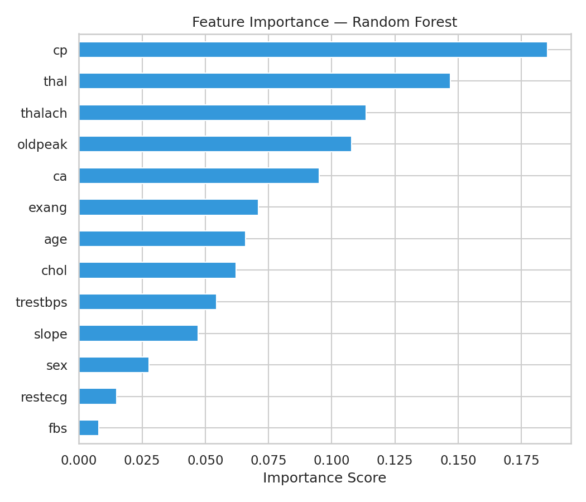

# Findings & Conclusions — Heart Disease Risk Prediction

## 1. Executive Summary

This project analyzes 303 anonymized patient records to explore risk factors
for heart disease and build a predictive model. After cleaning the data
(removing 1 duplicate record → 302 patients), a tuned Random Forest classifier
achieved **80.3% accuracy** and a **ROC-AUC of 0.90** on held-out test data,
correctly identifying **94% of actual heart disease cases** (recall).

## 2. Dataset Overview

- 302 patients after cleaning, 138 without heart disease and 164 with heart
  disease — a reasonably balanced dataset.
- No missing values in any of the 13 clinical features.

## 3. Exploratory Data Analysis

### 3.1 Age

Average age was **52.6 years** for patients with heart disease vs. **56.6
years** for those without — in this dataset, disease presence was not simply
"the older patients get sicker." Most patients across both groups fall
between 45 and 65 years old.

### 3.2 Chest Pain Type (`cp`)

Chest pain type was the single most correlated feature with the diagnosis
(correlation ≈ **+0.43**). Patients reporting chest pain types 1 and 2 were
far more likely to be diagnosed with heart disease than those reporting type
0 (typical angina) — of the 143 patients with `cp = 0`, only 39 (27%) had
heart disease, while of the 86 patients with `cp = 2`, 68 (79%) did.

### 3.3 Age vs. Maximum Heart Rate

Maximum heart rate achieved (`thalach`) was the second most correlated
feature (**+0.42**) — patients with heart disease in this dataset tended to
reach a *higher* max heart rate during testing (mean 158 bpm) than those
without (mean 139 bpm). This runs counter to the common assumption that a
higher achievable heart rate always signals better cardiovascular health,
and is a good example of why exploratory analysis matters before assuming
domain intuition holds in a specific dataset.

### 3.4 Feature Correlations

The correlation heatmap below shows how all 13 clinical features relate to
each other and to the target. Beyond `cp` and `thalach`, `exang`
(exercise-induced angina), `oldpeak` (ST depression), and `ca` (number of
major vessels) were the next most strongly associated features (all with
|correlation| > 0.40).

## 4. Modeling & Results

Three baseline classifiers were trained on an 80/20 stratified train-test
split with standardized features:

| Model | Accuracy | Precision | Recall | F1-score | ROC-AUC |
|---|---|---|---|---|---|
| Logistic Regression | 0.787 | 0.763 | 0.879 | 0.817 | 0.865 |
| Random Forest | 0.803 | 0.756 | 0.939 | 0.838 | 0.882 |
| K-Nearest Neighbors | 0.820 | 0.790 | 0.909 | 0.845 | 0.891 |

Random Forest was selected for hyperparameter tuning (via 5-fold
`GridSearchCV`) since tree ensembles handle the mix of continuous and
categorical clinical features well and expose feature importances for
interpretability. The best configuration
(`n_estimators=200, max_depth=5, min_samples_split=2`) achieved:

- **Accuracy: 80.3%**
- **Recall (disease detected): 93.9%**
- **ROC-AUC: 0.903**
- **5-fold CV accuracy: 83.4% (± 5.6%)**, confirming the result is stable
  across different data splits, not a lucky train/test split.

The high recall (93.9%) is a deliberately favorable property for a health
screening context: the model misses very few true heart disease cases,
though this comes with a moderate false-positive rate (its precision is
75.6%) — patients flagged as high-risk would still need clinical
confirmation.

## 5. Feature Importance

According to the tuned Random Forest, the clinical features that mattered
most for prediction were (in order): chest pain type (`cp`), number of major
vessels (`ca`), maximum heart rate (`thalach`), ST depression (`oldpeak`),
and thalassemia status (`thal`).

## 6. Conclusions

- A relatively simple model trained on 13 routine clinical measurements can
  identify heart disease risk with **~80% accuracy and 90% ROC-AUC** —
  reinforcing that structured patient data holds strong predictive signal
  even without imaging or genetic data.
- **Chest pain type, number of major vessels affected, and maximum heart
  rate achieved** were the strongest predictors of heart disease in this
  dataset, more so than age or cholesterol alone.
- The high recall (93.9%) makes this approach suitable as a **first-pass
  screening aid** to flag at-risk patients for further clinical testing,
  rather than a stand-alone diagnostic tool.

## 7. Limitations & Future Work

- The dataset is small (302 patients) and from a single source (Cleveland
  Clinic Foundation), which limits how well the model would generalize to
  other populations.
- No external validation set from a different hospital/region was available.
- Future work could explore gradient boosting models (XGBoost/LightGBM),
  SHAP-based interpretability, and validation on a larger, more diverse
  patient population.
